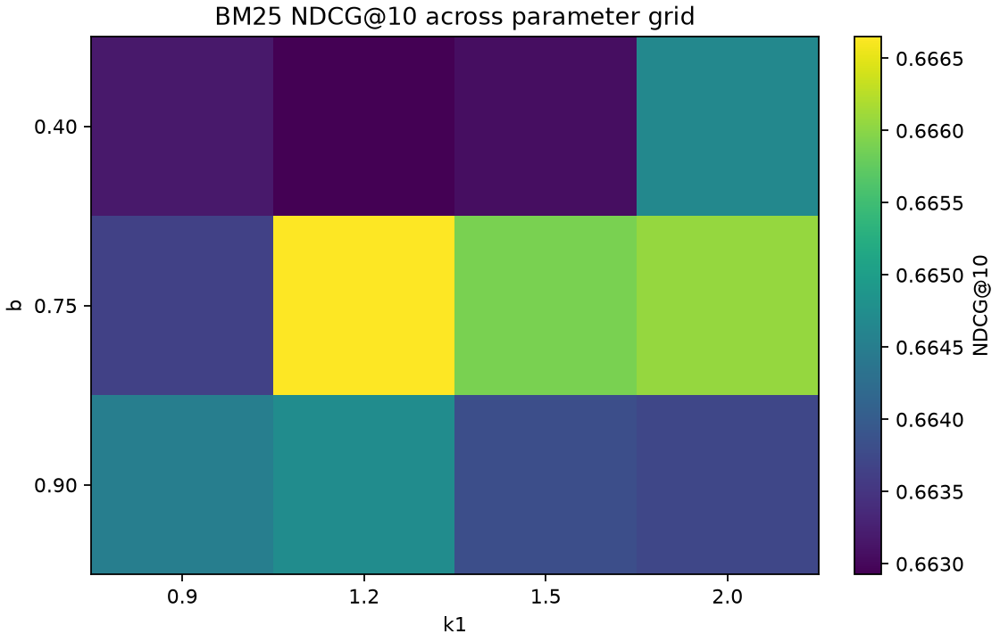

# SciFact Ranker Evaluation

Evaluated 1,109 labeled SciFact queries at k = 10 using the combined train and test relevance labels.

## Ranker Results

| Ranker | Parameters | Precision@10 | Recall@10 | MRR | NDCG@10 | Average query latency |
| --- | --- | ---: | ---: | ---: | ---: | ---: |
| TF-IDF | default | 0.086 | 0.769 | 0.609 | 0.642 | 1.489 ms/query |
| BM25 | k1=1.2, b=0.75 | 0.088 | 0.790 | 0.634 | 0.667 | 6.921 ms/query |

Best BM25 setting by aggregate NDCG@10: `k1=1.2, b=0.75`.

## BM25 Grid

| k1 | b | Precision@10 | Recall@10 | MRR | NDCG@10 | Average latency |
| ---: | ---: | ---: | ---: | ---: | ---: | ---: |
| 0.9 | 0.40 | 0.088 | 0.786 | 0.631 | 0.663 | 7.069 ms/query |
| 0.9 | 0.75 | 0.088 | 0.788 | 0.630 | 0.664 | 6.913 ms/query |
| 0.9 | 0.90 | 0.088 | 0.788 | 0.632 | 0.665 | 6.959 ms/query |
| 1.2 | 0.40 | 0.087 | 0.783 | 0.631 | 0.663 | 6.930 ms/query |
| 1.2 | 0.75 | 0.088 | 0.790 | 0.634 | 0.667 | 6.921 ms/query |
| 1.2 | 0.90 | 0.088 | 0.787 | 0.632 | 0.665 | 6.861 ms/query |
| 1.5 | 0.40 | 0.088 | 0.784 | 0.631 | 0.663 | 6.856 ms/query |
| 1.5 | 0.75 | 0.088 | 0.784 | 0.634 | 0.666 | 6.865 ms/query |
| 1.5 | 0.90 | 0.088 | 0.785 | 0.632 | 0.664 | 6.825 ms/query |
| 2.0 | 0.40 | 0.087 | 0.784 | 0.633 | 0.665 | 6.857 ms/query |
| 2.0 | 0.75 | 0.088 | 0.785 | 0.635 | 0.666 | 6.865 ms/query |
| 2.0 | 0.90 | 0.088 | 0.786 | 0.631 | 0.664 | 6.918 ms/query |

## Parameter Heatmap

## Why the Rankers Differ

BM25 leads NDCG@10 at 0.667, placing relevant documents higher in the top ten for this query set. Its term-frequency saturation and document-length normalization differ from TF-IDF's logarithmic term frequency. TF-IDF's NDCG@10 is 0.642, showing a lower average ranking quality on these labels. The BM25 parameters were selected by aggregating NDCG@10 across all labeled queries, not a single query.

Full ranker metrics are also available in `EVALUATION_RESULTS.csv`.
