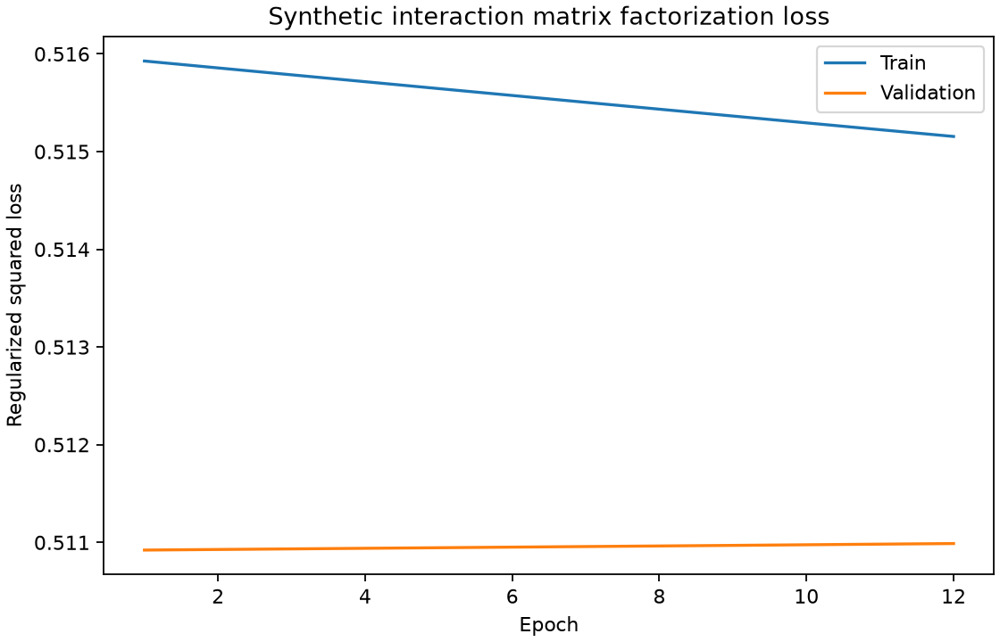
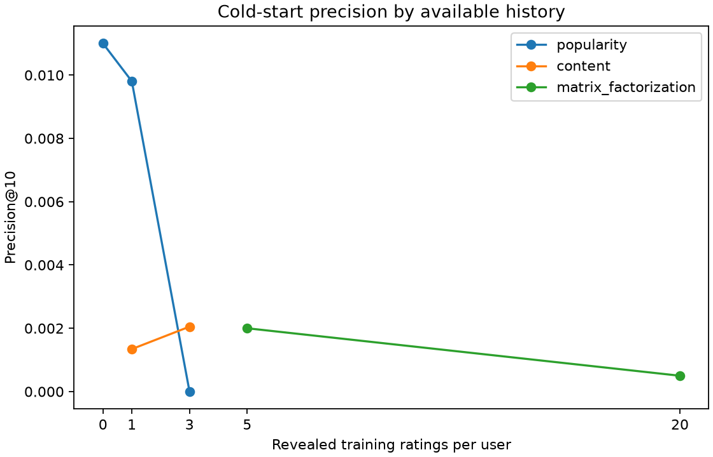

# MiniSearch Recommender

**Data note:** SciFact has documents and relevance labels, but no user interaction
data. The recommender's users and ratings will be synthetic; their results show
that the implementation and math work, not real-world recommendation quality.

## D2: Cosine Similarity Speed

Measured on the full SciFact index (5,183 documents, 35,941 terms), using document
`10009203` as the query and the top 10 recommendations. Each implementation ran
50 times; result document IDs matched, with scores equal within floating-point
tolerance. The measurement was taken on the local Apple Silicon development
machine and is a comparison of these two implementations, not a general hardware
benchmark.

| Implementation | Average time per lookup |
| --- | ---: |
| SciPy sparse vectorized dot product | 3.176 ms |
| Plain-Python CSR loop | 152.893 ms |

The vectorized implementation was 48.1x faster in this run.

## Synthetic Recommendation Evaluation

SciFact contains documents but no user-rating data. All user IDs, topic preferences, and ratings below are synthetic, generated with fixed seeds from 5,183 documents; results validate the code and math, not real-world recommendation quality.

The matrix-factorization and baseline comparison uses the held-out ratings of 1,000 synthetic users.

### Matrix Factorization vs Baselines

| Strategy | Test RMSE | Precision@10 | Recall@10 |
| --- | ---: | ---: | ---: |
| popularity | N/A | 0.010 | 0.016 |
| random | N/A | 0.001 | 0.002 |
| matrix_factorization | 1.004 | 0.001 | 0.002 |

### Cold-Start Precision@10

| History ratings | Strategy | Precision@10 |
| ---: | --- | ---: |
| 0 | popularity | 0.011 |
| 1 | content | 0.001 |
| 1 | popularity | 0.010 |
| 3 | content | 0.002 |
| 3 | popularity | 0.000 |
| 5 | matrix_factorization | 0.002 |
| 20 | matrix_factorization | 0.001 |

Each user is held out from global training and reveals only the listed number of their training ratings. The strategy column shows the policy actually used; a 1–4 rating user without a liked item falls back to popularity.

### Plots

Naive Bayes accuracy is measured against D3 cluster labels. It reached 0.068 accuracy versus the 0.103 majority-class baseline on a held-out 20% of documents. These generated labels demonstrate classifier behavior, not real query intent.
